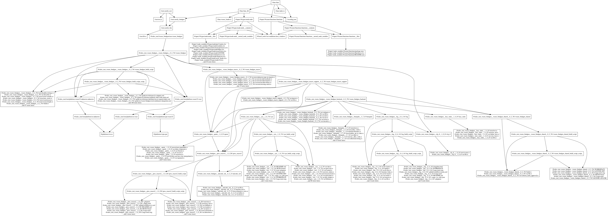

    

### What is Catsify?

Catsify is a Cat names generator, hosted on Azure Static Web Apps. The tech stack consists of:

- An [UI](./app) written in Angular v10 (preview).
- An [API](./api) written in Rust, compiled to WASM and exposed through a Node.js serverless Azure Function.

### Bazel dependency graph

    

